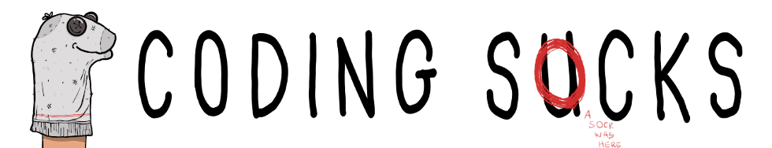

# Introduction to Coding Socks

The goal of this project is to:

- Work on OS projects with fast respond time (it is really annoying when you have to wait weeks).
- Create experimental projects that are not useful in real life but can be good for learning/studies.
- Write quality articles.

The organization has a generic name not to be tide to any language or framework.

# The mascot of Coding Socks

The mascot of Coding Socks is called Socket. Socket comes from the fusion of "sock" and "puppet".
